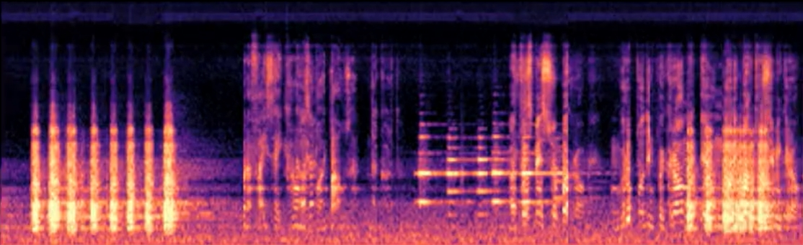

# NISPAE - Non Intrusive SPectrogram Analyses on the Edge - 

NISPAE is a Python application for performing Non-Intrusive SPectrogram Analyses on the Edge.
It is designed to analyze audio signals in real-time, without the need to collect any audio recordings, and extract relevant features using the short-time Fourier transform (STFT). This solution is particularly useful for recording in public places where concerns regarding privacy in regards to actual audio recording may arise.
NISPAE is optimized for running on edge devices with limited computational resources, such as Raspberry Pi (currently tested on Rpi 4 and Rpi 3B+). 



This project uses the following libraries
- [SoX](https://sox.sourceforge.net/Main/HomePage), which is used to capture audio from an external source (e.g. USB microphone)
- [Librosa](https://librosa.org/doc/latest/index.html), which is used to generate a Mel Spectrogram of the audio data
- [MatPlotLib](https://matplotlib.org/), which is used to produce the spectrogram image
- [Paho MQTT](https://www.eclipse.org/paho/index.php?page=clients/python/index.php), which is used to publish the image over MQTT


## Installation process

## Setup Rpi

To set up the Raspberry Pi, follow these steps:

- Prepare an SD card with the RaspberryPi OS Lite (Bullseye) and configure WiFi settings, enable SSH, set Host, user and password.
- Run the command ```apt-get update & upgrade``` to update and upgrade the system

## Prepare the environment

Install Python3-dev and python3-pip

```bash
apt install python3-dev python3-pip
```

Install dotenv to use environment variables

```bash
pip install python-dotenv
```

Install SoX and deps

```bash
apt-get install sox
apt-get install libsox-fmt-all
```

Install MatPlotLib and deps

```bash
apt-get install libjasper-dev
apt-get install libatlas-base-dev
pip install numpy
pip install matplotlib
```

Install Paho MQTT

```bash
pip install paho-mqtt
````

Install Librosa 

>> Note: Librosa cannot be installed directly on Raspberry Pi due to certain packages incompatibilities. However, there are several tutorials available online that provide a detailed process to overcome this limitation. Below are the main steps:

```bash
apt install libblas-dev llvm python3-pip python3-scipy

pip install virtualenv
```
>> Note: Add virtual env to the PATH E.g.: PATH=$PATH:/home/pi/.local/bin

```bash
#create the a virtualenv
virtualenv --system-site-packages -p python3 env

# enter the virtualenv; use `deactivate` to exit the virtualenv
source env/bin/activate

#install llvmlite, numba and librosa
pip install llvmlite
pip install numba
pip install librosa
```

# NIEPAE settings

Most of the variables of the Python script do not need to be changed, but depending on the microphone used it will be necessary to change the input audio form the ```SoX``` command line, the default value used is `alsa hw:1,0`. 

To now the recording devices connected use `arecord -l` (if no results, but the device is connected, run it again using `sudo`)

Other variables:
```py
# Define the MQTT broker parameters 
broker_address = "MQTT.address.of.the.broker"
broker_port = port
# username = # to be set in ENV FILE
# password = # to be set in ENV FILE
topic = "topic/where/publish"

# Generate a random client ID
client_id = f"python-{random.randint(0, 1000000)}"

# Define the audio parameters
sample_rate = 44100 # Sample rate of the audio 
duration = 1  # duration of audio to record in seconds
channels = 1 # use only MONO, multi channels may require MFCC (librosa.feature.mfcc)
NFFT_val = 2048 # FFT points per chunk
hop_length_val = 1024 # generally NFFT/2
fmin_val = 20 #lowest frequency (in Hz)
# fmax = sample_rate/2 #highest frequency (in Hz). If None, use fmax = sample_rate / 2.0

n_mels_val = 128 # number of Mel bins

ref_norm = 10 #value to normalise the spectrogram samples

vmin_value = -60 #min dB value for the output image
vmax_value = 0 #max dB value for the output image

#Choose the type of Spectrogram to create: 1- Mel Librosa ; 2- Linear[todo] 
spectro = 1
```

## Visualisation

There is a straightforward example in the `dataViz` folder that demonstrates how to consume spectrogram images from MQTT. Whenever a message is received, a new `img` element is created and appended to the `image-container` div. Broker address (ws or wss) and port need to be changes.
